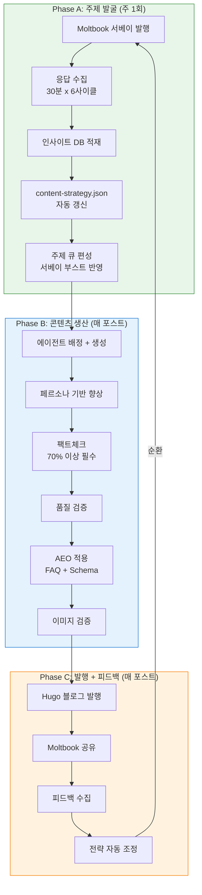
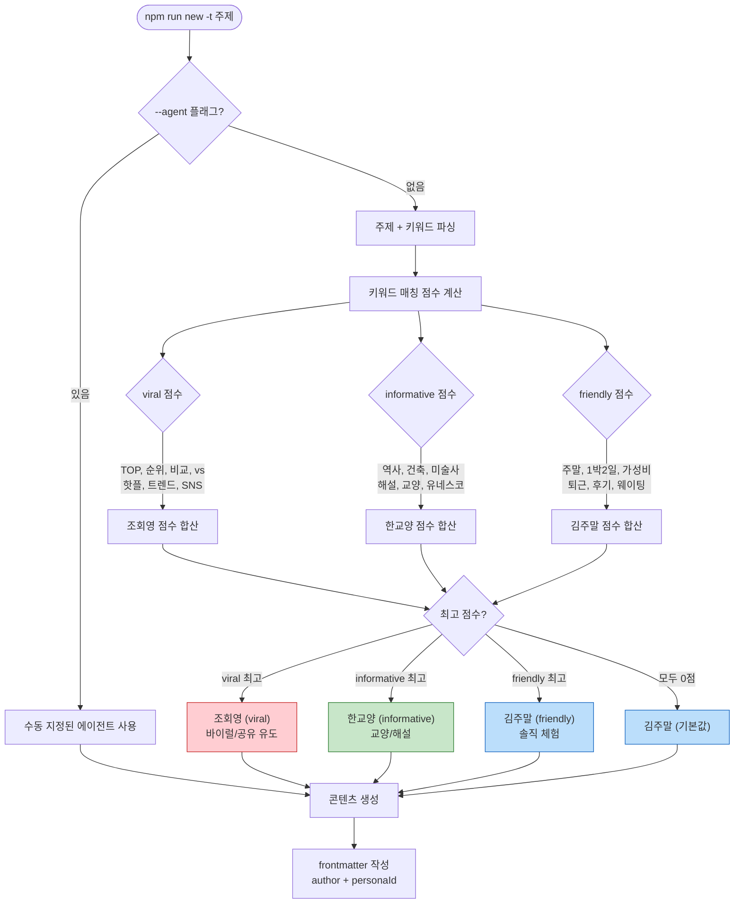
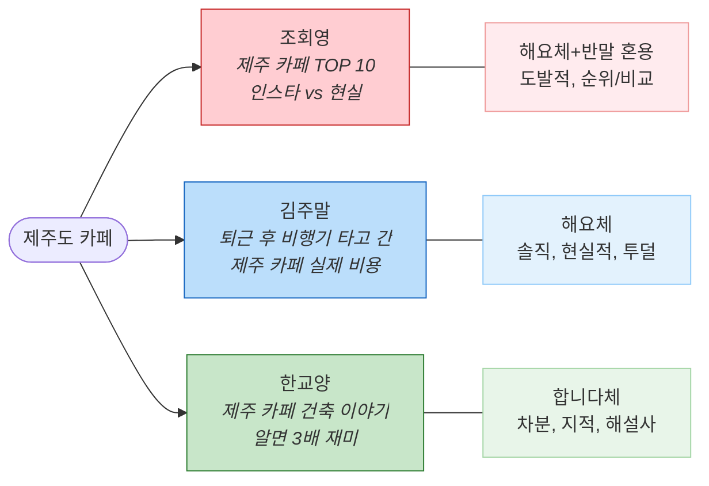
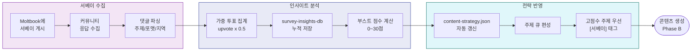
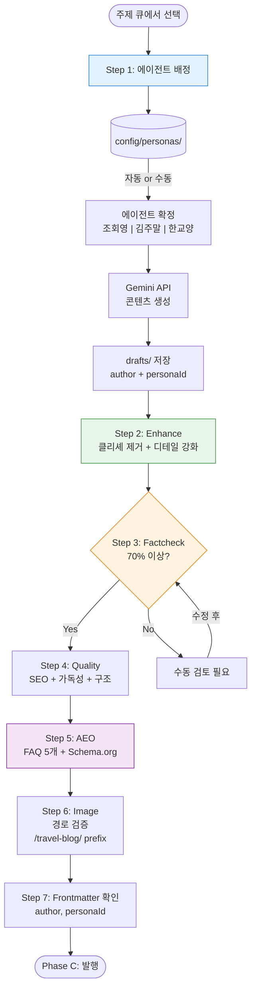
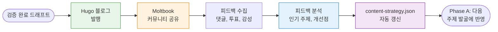
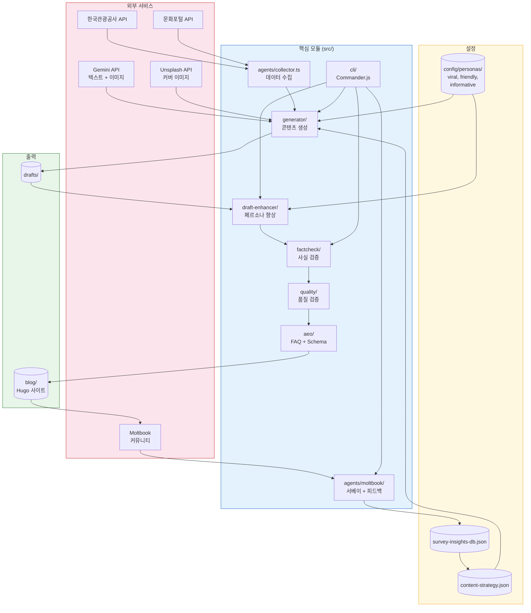
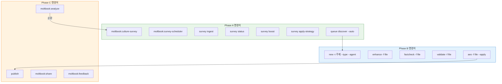
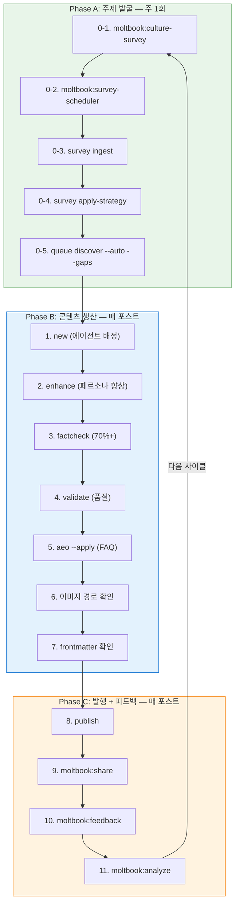

# OpenClaw 워크플로우 다이어그램

OpenClaw 콘텐츠 자동화 시스템의 전체 워크플로우를 시각화한 문서입니다.

---

## 1. 전체 콘텐츠 라이프사이클

3개 Phase가 순환하는 완전한 콘텐츠 루프입니다.

---

## 2. 에이전트 페르소나 배정 흐름

주제 입력 시 키워드 매칭으로 에이전트가 자동 결정됩니다.

---

## 3. 3인 에이전트 페르소나 비교

같은 주제도 에이전트에 따라 완전히 다른 콘텐츠가 됩니다.

---

## 4. 서베이 → 주제 발굴 파이프라인

커뮤니티 수요를 데이터로 전환하는 과정입니다.

---

## 5. 콘텐츠 생산 파이프라인 (Phase B 상세)

매 포스트마다 거치는 7단계 품질 보증 프로세스입니다.

---

## 6. 발행 + 피드백 루프 (Phase C 상세)

발행 후 커뮤니티 피드백이 다음 콘텐츠 전략에 자동 반영됩니다.

---

## 7. 시스템 아키텍처 전체도

주요 모듈과 데이터 흐름을 한눈에 보여줍니다.

---

## 8. 데이터 저장소 맵

각 단계에서 읽고 쓰는 파일의 관계입니다.

```mermaid
flowchart TD
    subgraph Write["쓰기"]
        direction TB
        W1["npm run new → drafts/*.md"]
        W2["npm run enhance → drafts/*.md (덮어쓰기)"]
        W3["npm run aeo --apply → drafts/*.md (FAQ 추가)"]
        W4["npm run publish → blog/content/posts/"]
        W5["survey ingest → data/survey-insights-db.json"]
        W6["survey apply-strategy → config/content-strategy.json"]
        W7["moltbook:analyze → config/content-strategy.json"]
    end

    subgraph Read["읽기"]
        direction TB
        R1["generator/index.ts ← config/personas/index.json"]
        R2["generator/prompts.ts ← config/personas/{id}.json"]
        R3["draft-enhancer/ ← config/personas/{id}.json"]
        R4["topic-discovery.ts ← data/survey-insights-db.json"]
        R5["queue discover ← config/content-strategy.json"]
    end

    style Write fill:#ffebee,stroke:#c62828
    style Read fill:#e8f5e9,stroke:#2e7d32
```

---

## 9. CLI 명령어 맵

주요 명령어가 어떤 Phase에 속하는지 보여줍니다.

---

## 10. 워크플로우 체크리스트 (실행 순서)

